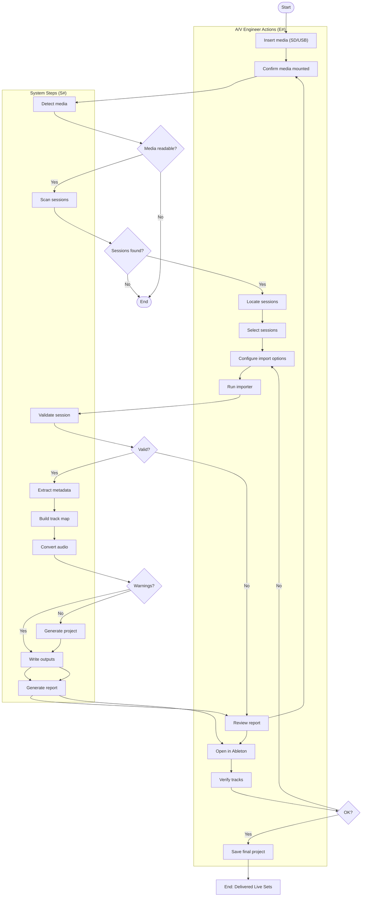

```mermaid
flowchart TD

  start([Start]) --> E1

  subgraph AV["A/V Engineer Actions (E#)"]
    direction TB
    E1["Insert media (SD/USB)"]
    E2["Confirm media mounted"]
    E3["Locate sessions"]
    E4["Select sessions"]
    E5["Configure import options"]
    E6["Run importer"]
    E7["Review report"]
    E8["Open in Ableton"]
    E9["Verify tracks"]
    E10["Save final project"]
  end

  subgraph SYS["System Steps (S#)"]
    direction TB
    S1["Detect media"]
    S2["Scan sessions"]
    S3["Validate session"]
    S4["Extract metadata"]
    S5["Build track map"]
    S6["Convert audio"]
    S7["Generate project"]
    S8["Write outputs"]
    S9["Generate report"]
  end

  E1 --> E2 --> S1

  S1 --> D1{Media readable?}
  D1 -- No --> ENDSTOP([End])
  D1 -- Yes --> S2 --> D2{Sessions found?}

  D2 -- No --> ENDSTOP
  D2 -- Yes --> E3 --> E4 --> E5 --> E6 --> S3 --> D3{Valid?}

  D3 -- No --> E7 --> E2
  D3 -- Yes --> S4 --> S5 --> S6 --> D4{Warnings?}

  D4 -- Yes --> S8 --> S9 --> E7 --> E8
  D4 -- No --> S7 --> S8 --> S9 --> E8 --> E9 --> D5{OK?}

  D5 -- No --> E5
  D5 -- Yes --> E10 --> FINAL[End: Delivered Live Sets]
```